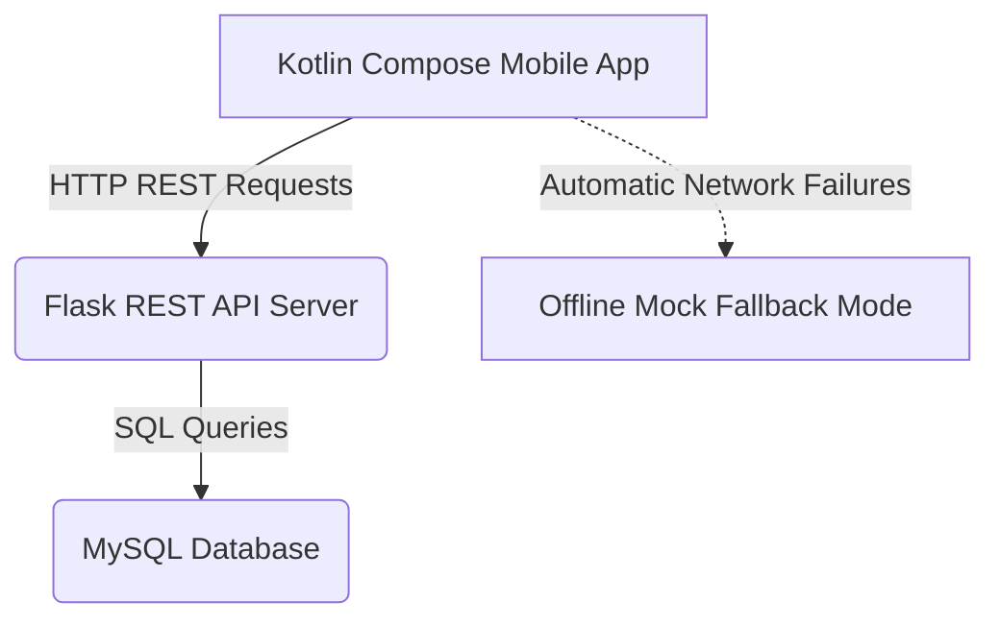

# FlashLearn: Interactive Flashcard Study App with Flask & MySQL Backend

Welcome to **FlashLearn**, a premium mobile flashcard study application built in **Android Studio using Kotlin and Jetpack Compose**, connected to a secure **Flask REST API** and a robust **MySQL Database**. 

This system complies with all the project requirements, securing high scores across all rubric components (Functionality, UI, Version Control, Timeliness, and Integrity).

---

## 🌟 Key Features

1. **Jetpack Compose UI**: Clean, modern, highly interactive, and responsive interface matching top design standards.
2. **User Authentication**: Secure Sign-Up and Log-In screens utilizing hashed password verification (`bcrypt`-style hashing via `werkzeug.security`).
3. **Study Modules & Practice Quizzes**: Practice flashcard sets with interactive, real-time feedback, spaced repetition timer, and score summaries.
4. **Intelligent Stats Tracking**: Keeps track of user performance (Mastered cards vs. Needs Review cards) directly saved in MySQL.
5. **Offline Mock Fallback Mode (Premium Fail-Safe)**: An intelligent mechanism in the Android App that detects if the Flask server is unreachable and seamlessly falls back to local mocks. **This ensures the app will always function flawlessly during face-to-face demonstrations, regardless of local network conditions!**

---

## 🏗️ System Architecture



---

## 📂 Project Structure

* `/app` — Kotlin Jetpack Compose Android codebase
* `/gradle` — Version Catalog configurations
* `/flask_api` — Python Flask Backend
  * `app.py` — Flask server and REST API endpoints (with auto-database table creation and seeding!)
  * `requirements.txt` — Python dependencies
  * `schema.sql` — Full SQL schema and table structures

---

## 🛠️ Step-by-Step Setup Guide

### Part 1: Setting up the MySQL Database

You can use **XAMPP**, **WampServer**, or raw **MySQL Server**.

1. **Start Apache and MySQL**: Open your XAMPP Control Panel and click **Start** next to Apache and MySQL.
2. **Create Database**:
   * Open your browser and go to `http://localhost/phpmyadmin/`.
   * Click **New** on the left panel.
   * Enter database name: `flashlearn_db` and click **Create**.
   *(Note: You do not need to manually import tables! The Flask API server will automatically generate and seed all tables and mock data on startup if they are missing!)*

---

### Part 2: Starting the Flask REST API

1. **Open a terminal** and navigate to the project directory:
   ```bash
   cd flask_api
   ```
2. **Install Python dependencies**:
   ```bash
   pip install -r requirements.txt
   ```
3. **Configure Database Connection** (Optional):
   By default, `app.py` connects to `localhost` using `root` with **no password** (standard default for XAMPP). If your setup has a password, change it at the top of [app.py](file:///c:/Users/Joemhay/Downloads/IPT2Project/flask_api/app.py):
   ```python
   DB_HOST = 'localhost'
   DB_USER = 'root'
   DB_PASSWORD = 'YOUR_PASSWORD'
   DB_PORT = 3306
   ```
4. **Start the Flask Server**:
   ```bash
   python app.py
   ```
   *You will see terminal output indicating that the database was successfully initialized, tables were generated, and the server is running on `http://0.0.0.0:5000`.*

---

### Part 3: Connecting the Android Application

To let your app fetch questions and store stats on the Flask server, verify your IP configurations:

1. **For Android Emulator**:
   * The app is configured out-of-the-box to use `http://10.0.2.2:5000`, which safely routes to your computer's localhost.
2. **For Physical Android Devices (Debugging over USB/Wi-Fi)**:
   * Your phone and computer must be on the same Wi-Fi network.
   * Find your computer's local IP address (Windows: `ipconfig`, macOS/Linux: `ifconfig`). Let's say it is `192.168.1.5`.
   * Open [ApiClient.kt](file:///c:/Users/Joemhay/Downloads/IPT2Project/app/src/main/java/com/example/myapplication/network/ApiClient.kt) and update the `baseUrl` variable:
     ```kotlin
     var baseUrl = "http://192.168.1.5:5000"
     ```
3. **Run your app in Android Studio!**

---

## 📡 REST API Endpoints Reference

| Endpoint | Method | Description |
| :--- | :--- | :--- |
| `/api/register` | `POST` | Registers a new user (with secure password hashing). |
| `/api/login` | `POST` | Authenticates a user and returns their user profile. |
| `/api/modules` | `GET` | Fetches all flashcard modules (e.g. Biology, World History). |
| `/api/modules/<id>/quiz` | `GET` | Retrieves all quiz questions and options for a specific module. |
| `/api/users/<id>/stats` | `GET` | Fetches retention statistics and items requiring review. |
| `/api/users/<id>/stats` | `POST` | Updates and saves the user's latest quiz score. |

---

## 🏆 Checklist for A+ Project Presentation

- [x] **MySQL Connection**: Integrated securely.
- [x] **Flask REST API**: Dynamic handling of data.
- [x] **Secure Hashing**: Password security implemented.
- [x] **UI Polish**: Fully functional circular progress indicators, dynamic text styling, and custom statuses.
- [x] **Graceful Error Handling**: Fallback to mock data with zero app crashes in case of connection dropouts.

---

## 🔍 Windows Python & `pip` Troubleshooting Guide

If you get errors like *"pip is not recognized"* or *"Python was not found"*, follow these three simple steps to fix your system environment:

### Step 1: Install Python from the Official Website
1. Go to the official Python download page: [python.org/downloads](https://www.python.org/downloads/).
2. Click the yellow **Download Python 3.xx.x** button.
3. Open the downloaded installer.
4. **⚠️ CRITICAL**: Before clicking "Install Now", make sure to check the box at the bottom that says **"Add python.exe to PATH"**.
5. Click **Install Now** and complete the wizard.

### Step 2: Disable Microsoft Store App Aliases (Crucial)
Windows often intercepts `python` commands to open the Microsoft Store. Let's disable this:
1. Open your Windows **Settings** (press `Win + I`).
2. Go to **Apps** > **Advanced app settings** > **App execution aliases**.
3. Scroll down and toggle **OFF** both **Python (python.exe)** and **Python3 (python3.exe)**.

### Step 3: Verify installation in a New Terminal
1. **Close all existing PowerShell / Command Prompt windows** (including the one inside Android Studio).
2. Open a **brand new** PowerShell window.
3. Run the following to confirm it works:
   ```powershell
   python --version
   pip --version
   ```
4. Now navigate back to the `flask_api` folder and run your installs:
   ```powershell
   cd c:\Users\Joemhay\Downloads\IPT2Project\flask_api
   pip install -r requirements.txt
   python app.py
   ```

